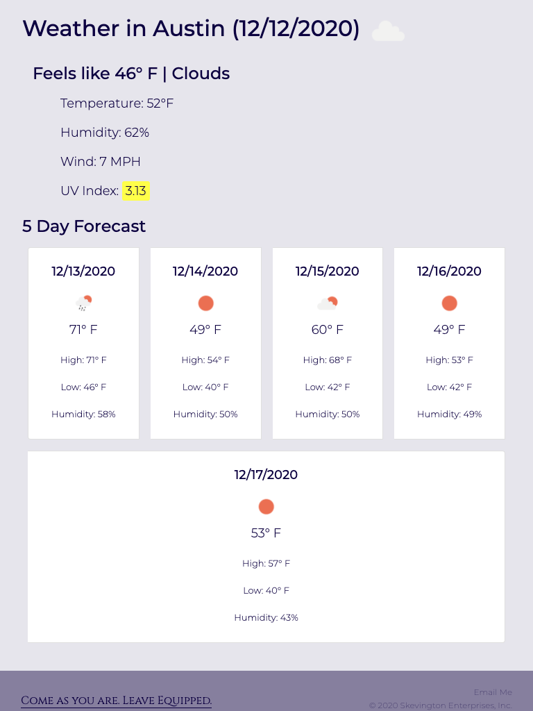

# Challenge 6 : Weather Dashboard | QS

For this week's challenge, we developed an interactive weather dashboard that allows users to search for and add cities they're interested in.

Table of Contents
* [User Story and Acceptance Criteria](#user-story-and-acceptance-criteria)
* [Key Features](#key-features)
* [Images](#images)

---

## User Story and Acceptance Criteria

### User Story
```
AS A traveler
I WANT to see the weather outlook for multiple cities
SO THAT I can plan a trip accordingly
```

### Acceptance Criteria
```
WHEN I search for a city
THEN I am presented with current and future conditions for that city and that city is added to the search history
```
```
WHEN I view current weather conditions for that city
THEN I am presented with the city name, the date, an icon representation of weather conditions, the temperature, the humidity, the wind speed, and the UV index
```
```
WHEN I view the UV index
THEN I am presented with a color that indicates whether the conditions are favorable, moderate, or severe
```
```
WHEN I view future weather conditions for that city
THEN I am presented with a 5-day forecast that displays the date, an icon representation of weather conditions, the temperature, and the humidity
```
```
WHEN I click on a city in the search history
THEN I am again presented with current and future conditions for that city
```

---

## Key Features

* Responsive layout leveraging Bootstrap Grid and Cards
* Previous searches are persisted in local storage
* Previous searches are displayed and may be clicked rather than entered again.
* Displays Feels Like, Current Conditioons, Temperature, Humidity, Wind Speed, and UV index for the current day. 
* Displays Daily Temperature, High Temperature, Low Temperature, and Humidity for the next 5 days.
* Displays icons to indicate weather conditions.

---
## Images
### Desktop View

1440px X 1112px


### iPad View 1

768px X 1024px


### iPad View 2

768px X 1024px



### iPhone 6 View 1

375px X 667px


### iPhone 6 View 2

375px X 667px

